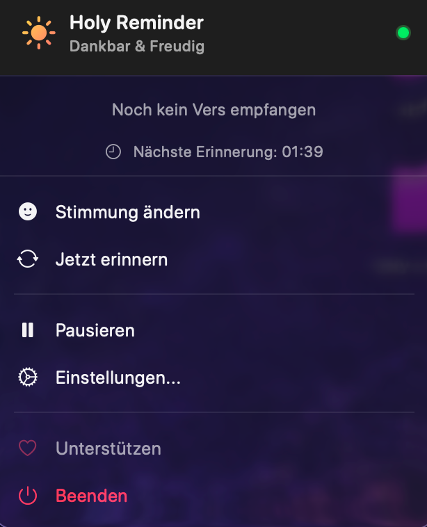
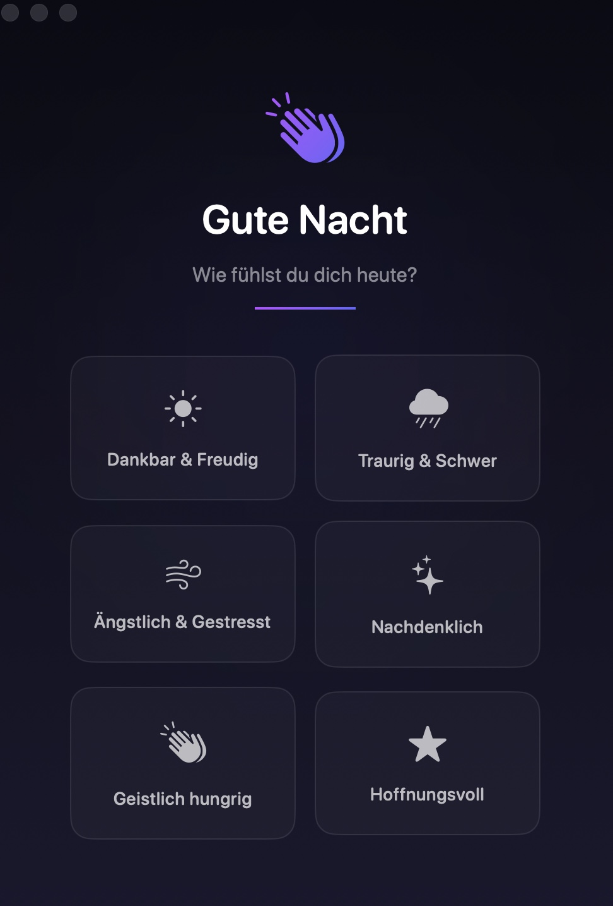
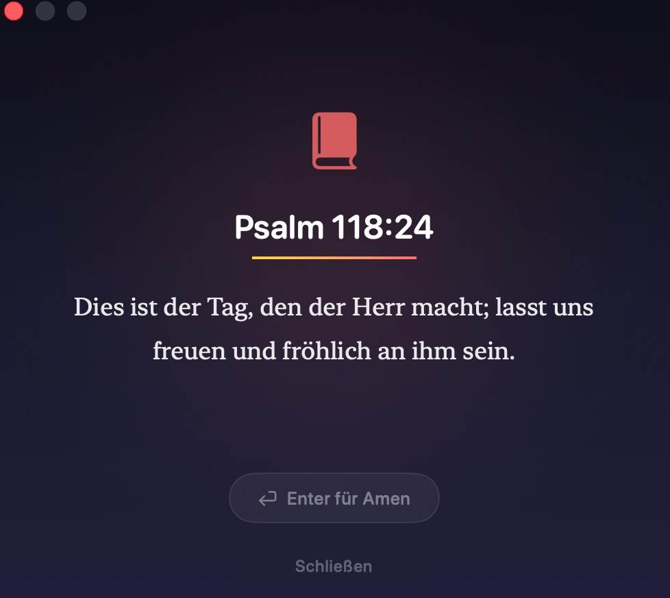

# Holy Reminder 📖

Eine minimalistische macOS Menu Bar App für tägliche Bibelerinnerungen.

| Menu | Stimmung wählen | Vers Ansicht |
|:---:|:---:|:---:|
|  |  |  |

## ✨ Features

- 🙏 **Tägliche Bibelverse** - Erhalte inspirierende Verse basierend auf deiner Stimmung
- 🎨 **Stimmungsbasiert** - Wähle zwischen 6 Stimmungen für passende Verse
- ⏰ **Anpassbare Erinnerungen** - Stelle die Häufigkeit nach deinen Wünschen ein
- 🌙 **Stille Zeiten** - Keine Benachrichtigungen während der Nacht
- 🎯 **Menu Bar Integration** - Diskret und immer erreichbar
- ✨ **Minimalistisches Design** - Elegant und unaufdringlich

## 📥 Installation

### Option 1: Download (Empfohlen)
1. Lade die neueste Version von der [Releases](../../releases) Seite herunter
2. Entpacke die ZIP-Datei
3. Ziehe "Holy Reminder" in den Applications Ordner
4. Starte die App aus dem Applications Ordner

### Option 2: Homebrew
```bash
brew tap lou1s19/holy-reminder
brew install holy-reminder
```

### Option 3: Aus dem Quellcode bauen
```bash
git clone https://github.com/lou1s19/Holy-Reminder.git
cd Holy-Reminder
swift build -c release
```

## 🎯 Nutzung

1. **Starte die App** - Das Icon erscheint in der Menüleiste
2. **Wähle deine Stimmung** - Beim ersten Start wählst du deine aktuelle Stimmung
3. **Erhalte Verse** - Du erhältst automatisch Bibelverse die zu deiner Stimmung passen
4. **Drücke Enter** - Um "Amen" zu sagen und den Vers zu bestätigen

## ⚙️ Einstellungen

- **Allgemein**: Bei Anmeldung starten, Stimmung ändern
- **Aussehen**: Wähle dein Menüleisten-Icon
- **Erinnerungen**: Häufigkeit, Stille Zeiten, Gebetserinnerungen

## 💬 Feedback & Wünsche

Hast du Verbesserungsvorschläge oder hast einen Bug gefunden?

- 📝 **[Neues Issue erstellen](../../issues/new)** - Für Bugs und Feature-Wünsche
- 💡 **[Alle Issues ansehen](../../issues)** - Schau was andere vorgeschlagen haben

## 🤝 Unterstützen

Wenn dir Holy Reminder gefällt, kannst du das Projekt unterstützen:

- [PayPal](https://www.paypal.com/paypalme/HoffnungaufJesus)
- [GoFundMe](https://gofund.me/0f408ddc)

## 📋 Systemanforderungen

- macOS 13.0 (Ventura) oder neuer
- Apple Silicon oder Intel Mac

## 📝 Lizenz

MIT License - Siehe [LICENSE](LICENSE) für Details.

## 🙏 Danksagung

Mit Liebe erstellt für alle, die täglich Gottes Wort erhalten möchten.

---

*„Dein Wort ist meines Fußes Leuchte und ein Licht auf meinem Wege."* - Psalm 119:105
